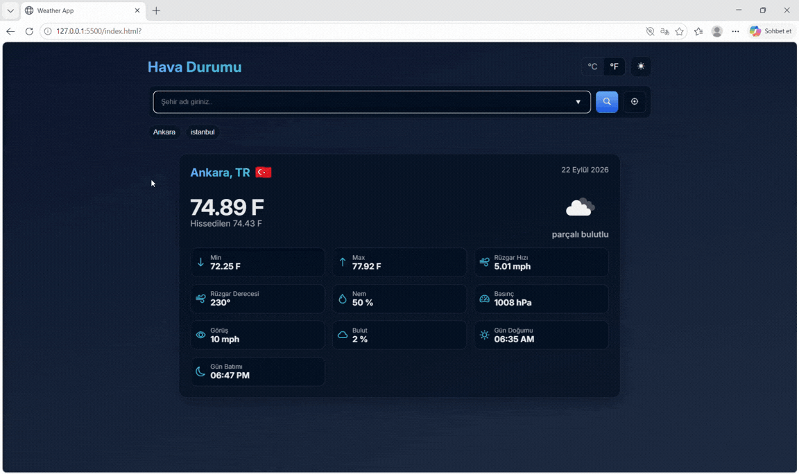

<h1>Weather App</h1>

A responsive weather application developed with <strong>HTML5, CSS3, and JavaScript</strong>. Users can search for cities, view current weather information, use their current location, change temperature units, and switch between light and dark themes.

<h2>Features</h2>

- City-based weather search
- Current location detection
- °C / °F unit selection
- Light / dark theme
- Recent searches
- City suggestions
- Responsive design
- Local Storage

<h2>Technologies Used</h2>

<strong>HTML5 · CSS3 · JavaScript · Fetch API · Geolocation API · Local Storage · Bootstrap Icons</strong>

<h3>Preview</h3>

